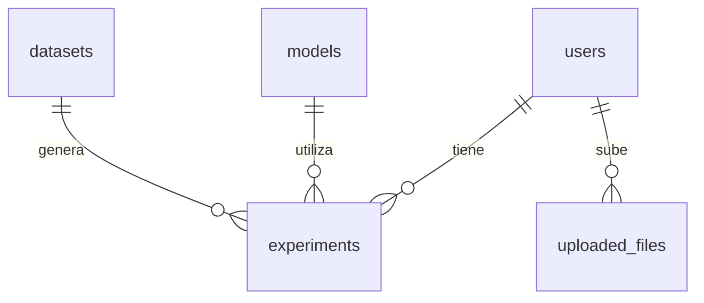

# Modelo Entidad-Relación (E-R)

Este documento describe el modelo entidad-relación que rige la base de datos del proyecto final, representando gráficamente y de manera textual las asociaciones entre las entidades principales.

## Diagrama E-R (Mermaid)

## Descripción Textual de las Relaciones

1. **Usuarios y Experimentos (`users` - `experiments`)**
   - **Relación:** Uno a muchos (`1:N`).
   - **Descripción:** Un usuario registrado en la plataforma puede configurar e historizar cero, uno o múltiples experimentos. Cada registro de experimento en la base de datos pertenece a un único usuario (`user_id` actúa como clave foránea).

2. **Usuarios y Archivos Subidos (`users` - `uploaded_files`)**
   - **Relación:** Uno a muchos (`1:N`).
   - **Descripción:** Un usuario puede subir cero o múltiples archivos de datos (datasets u otros formatos compatibles) para su procesamiento. Cada archivo cargado está directamente enlazado al usuario que realizó la acción (`user_id` es obligatorio y actúa como clave foránea).

3. **Modelos y Experimentos (`models` - `experiments`)**
   - **Relación:** Uno a muchos (`1:N`).
   - **Descripción:** Un modelo de Machine Learning (por ejemplo, Regresión Lineal, Bosques Aleatorios, etc.) del catálogo puede ser utilizado en cero o múltiples experimentos ejecutados por los usuarios. Cada experimento debe registrar qué modelo utilizó (`model_id` actúa como clave foránea).

4. **Datasets y Experimentos (`datasets` - `experiments`)**
   - **Relación:** Uno a muchos (`1:N`).
   - **Descripción:** Un dataset almacenado en el sistema puede servir de base para la generación de cero o múltiples experimentos. Cada experimento registra el conjunto de datos con el que fue entrenado y evaluado (`dataset_id` actúa como clave foránea).
