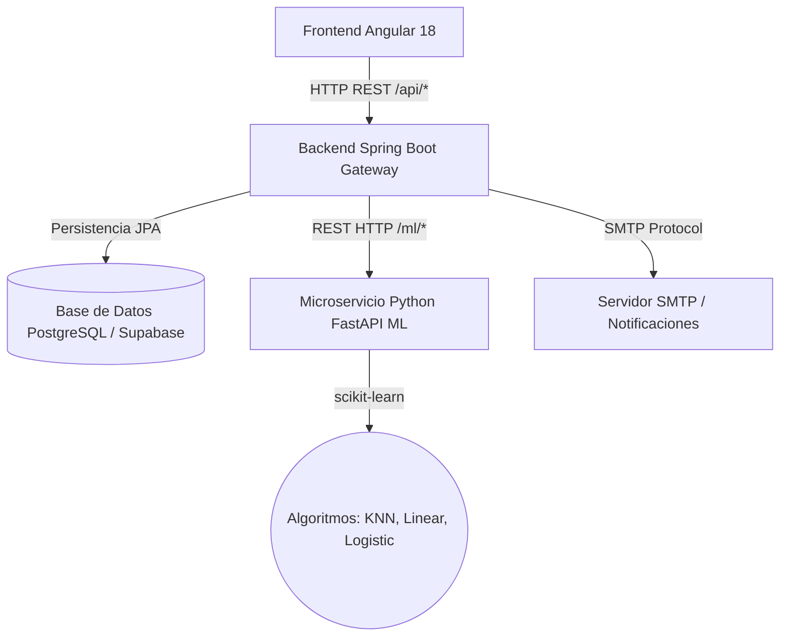

# Resumen de Arquitectura — ML Lab Full-Stack

Este documento resume la estructura arquitectónica del proyecto final de Tecnologías para el Desarrollo de Aplicaciones Web.

## Arquitectura de Microservicios y Gateway

El proyecto está diseñado bajo un patrón de microservicios con un Gateway unificado para la comunicación con el cliente:

### Componentes de la Arquitectura

1. **Client Tier (Frontend Angular 18+)**:
   - Single Page Application (SPA) construida con componentes declarativos.
   - Utiliza servicios inyectables (`MlService`, `UserService`, `EmailService`) para la comunicación remota.
   - Enrutamiento dinámico y formularios interactivos.

2. **Gateway Tier (Java Spring Boot)**:
   - Funciona como orquestador y pasarela API.
   - Expone endpoints REST en `/api/` y delega las operaciones analíticas al microservicio de Python.
   - Implementa persistencia relacional con PostgreSQL utilizando Spring Data JPA.
   - Genera dinámicamente reportes en PDF utilizando la biblioteca Apache PDFBox (`PdfService`).
   - Envía correos electrónicos de confirmación mediante el protocolo SMTP.

3. **Analytics Tier (Python FastAPI)**:
   - Microservicio ligero especializado en cómputo matemático y entrenamiento ágil.
   - Utiliza la biblioteca **scikit-learn** para ejecutar algoritmos clásicos de aprendizaje automático: K-Nearest Neighbors (KNN), Regresión Lineal y Regresión Logística.
   - Genera gráficos descriptivos con **matplotlib**.

4. **Database Tier (Supabase/PostgreSQL)**:
   - Almacenamiento seguro y persistente de usuarios, datasets, modelos y ejecuciones históricas (experimentos).
